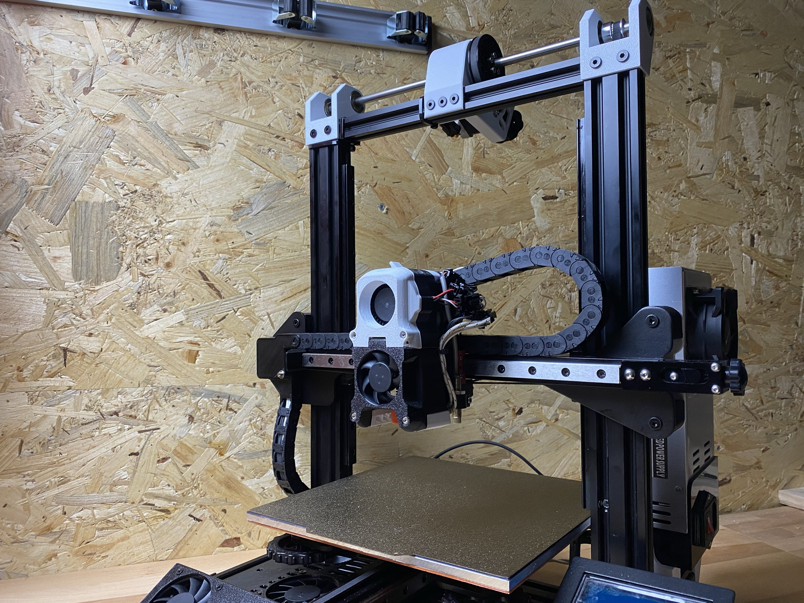
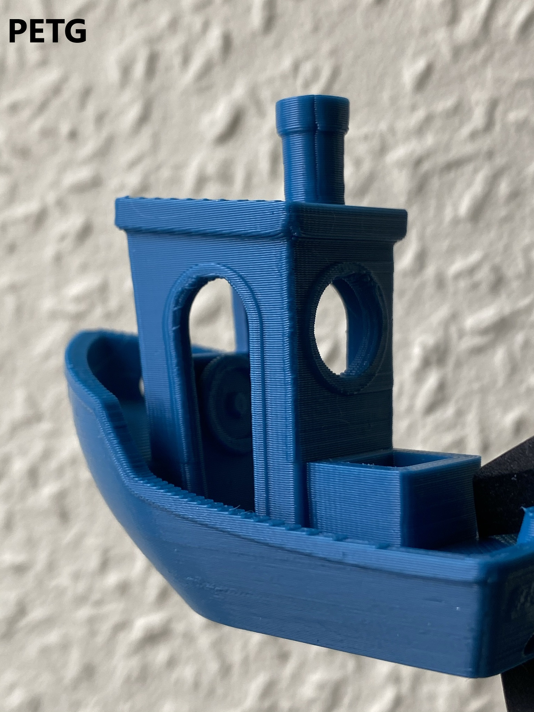
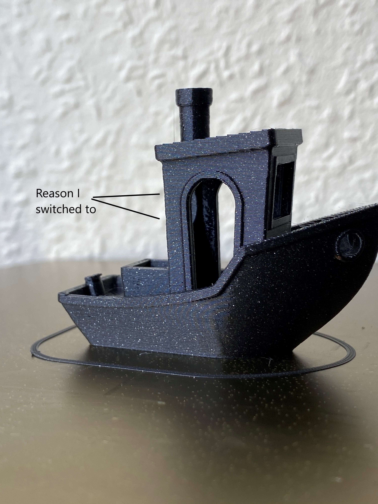
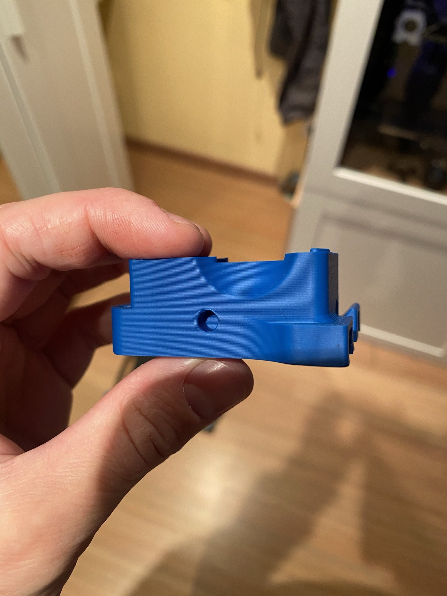
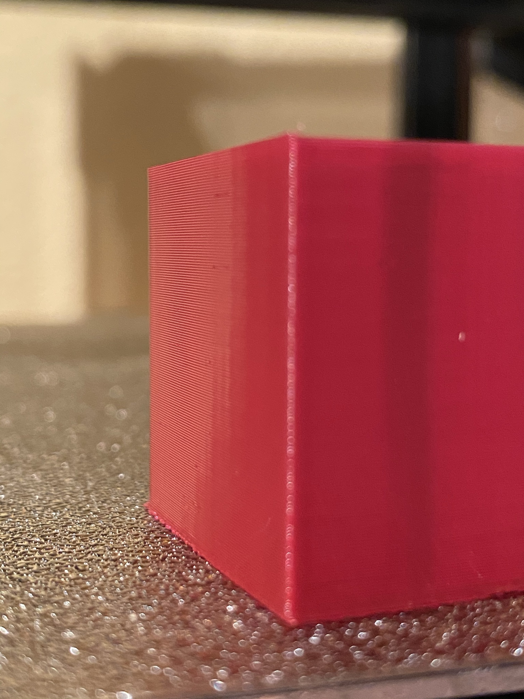

# BeltDrivenEnder3

 

---

## Please read Instructions and BOM for more informations.

Written Intructions will be updated soon! Please use my videos in the meantime.
Feel free to contact me on Discord: kevinakasam#2097

Huge thanks to my mate Deutherius, who helped me over months, tested everything and brought this mod to perfection. Many thanks for the help, the photos and the new heated bed!

Attention!
I'm not an expert and 3D printing is my hobby. So please be careful when you rebuild this printer and don't just go ahead. For my printer the parts fit perfectly.
Everybody bears the risks of a modification himself.
All parts can be modified as you like.

First things first:
My Ender 3 always had problems with the Z-axis, which were caused by a bent and misaligned leadscrew. Therefore I decided to convert the Ender to belts in Z as well.
This mod also solves the problem of a hanging x-axis on the right side. Because of the two belts both sides run synchronously and can also be adjusted very precisely.
So if you have these problems with the z-axis/x-axis, this is a good solution.

Good luck and happy printing!

## THANK YOU VERY MUCH!
I want to thank everyone who has helped me over the last months with feedback, support and confidence. Without you this mod would not have become so big! Thanks also to Creality for the Golbal DIY Contest. I am very proud to announce that I could reach the 3rd place with.

## Print Showcase
 
 
 

## Finally the video tutorials are finished!

https://youtu.be/bxTwFCPEIgg

https://youtu.be/oUdoJUs8Zcg

---
### Changelog:
17.08.2021: Made some small tolerance changes to the rotated transmission and the inner M3 parts.

31.07.2021: I made a mistake and uploaded the wrong files for "LeftTop" and RightTop". If you downloaded the files from Thingiverse between 15.06.2021 and 31.07.2021, please download the latest version. I am very sorry! Thanks to mbarryton for the hint!

15.06.2021: **Important!!!** Both Versions (rotated and unrotated) are compatible now. Both versions now have the identical LeftTop and RightTop (the one from the rotated version).

15.06.2021: I have added a version of both transmissions that include a ball bearing. So the rod is supported in the middle by another ball bearing.

15.06.2020:  Updated CAD with all Versions. Many thanks to Regulus who did a great job adding many wonderful details to the CAD file. All parts are now properly aligned, all fasteners are added and named. Seriously many many thanks!

02.06.2021: Added Left and Right V3.3. Changed the design of the lower clamp profile. If youre using the 3.1 or 3.2 that's totally fine;)

02.06.2021: Updated the 80T Gear on GitHub. reduced the outer diameter a bit so theres a bigger gap to the profile. Thanks to Regulus!

06.05.2021: Modified MGN Version fits now for Ender 3 (Pro) and Ender 3 V2. Bowden Version tested. Thanks to Jon!

04.05.2021: Added a Video Tutorial.

02.05.2021: Added Left and Right V3.2. Tensioner were missaligned by ~0.5mm. Thanks to Zardozer for the hint! If youre using the old V3.1 its totally fine. I'm using them as well:D

14.02.2021: Changes for the MGN Version!! LeftV1 added. Please print 1_Left and 1_LeftV1. I would appreciate feedback for Left or LeftV1. I have created the files with the official CAD, but the M4 screws differ in the position by 2mm. Please print both versions and tell me which fits, thanks:)

26.02.2021: Added Bowdenversion.

26.02.2021: Started Changelog.

---

# V-Wheel Version

# MGN Rail Version

