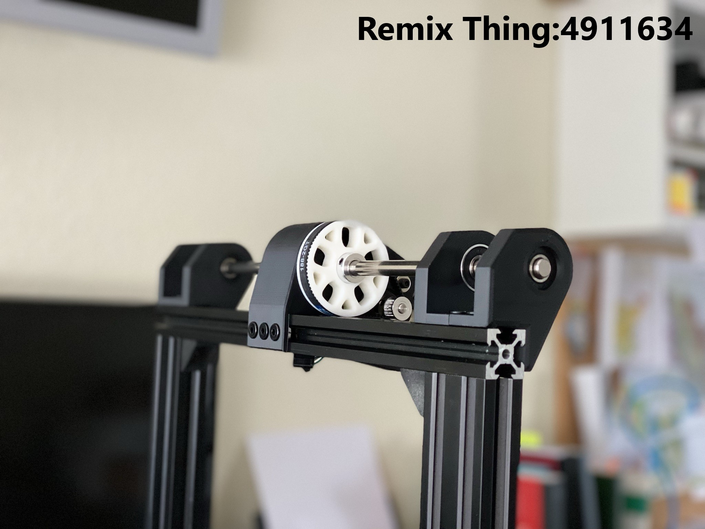

# BeltDrivenEnder3

 

---

## Please read Instructions and BOM for more informations.

Written Intructions will be updated soon! Please use my videos in the meantime.
Feel free to contact me on Discord: kevinakasam#2097

Huge thanks to my mate Deutherius, who helped me over months, tested everything and brought this mod to perfection. Many thanks for the help, the photos and the new heated bed!

Attention!
I'm not an expert and 3D printing is my hobby. So please be careful when you rebuild this printer and don't just go ahead. For my printer the parts fit perfectly.
Everybody bears the risks of a modification himself.
All parts can be modified as you like.

First things first:
My Ender 3 always had problems with the Z-axis, which were caused by a bent and misaligned leadscrew. Therefore I decided to convert the Ender to belts in Z as well.
This mod also solves the problem of a hanging x-axis on the right side. Because of the two belts both sides run synchronously and can also be adjusted very precisely.
So if you have these problems with the z-axis/x-axis, this is a good solution.

Good luck and happy printing!

## Table of contents
1. [Thank you very much!](##thank-you-very-much)
2. [Print Showcase](##print-showcase)
3. [Video Tutorials](##finally-the-video-tutorials-are-finished)
4. [FAQ](##FAQ)
5. [Troubleshooting](##troubleshooting)
6. [Changelog](##changelog)

## THANK YOU VERY MUCH!
I want to thank everyone who has helped me over the last months with feedback, support and confidence. Without you this mod would not have become so big! Thanks also to Creality for the Golbal DIY Contest. I am very proud to announce that I could reach the 3rd place with.

## Print Showcase
 
 
 

## Finally the video tutorials are finished!

https://youtu.be/bxTwFCPEIgg

https://youtu.be/oUdoJUs8Zcg

## FAQ 
### Do I need to change the firmware?
NO! You do not have to change anything in the firmware. This modification work with the stock board and stock firmware.

### Can I use PLA to print the parts?
Yes and no. All parts should work with PLA, except the motor tensioner arm. The motor has to hold more weight now, so the motor could get warm. Since PLA deforms at ~40°C you should keep an eye on your motor (see troubleshooting). Because of that I would recommend PETG. When you're printing inside an enclosure you should use ABS. Try Esun ABS+, super easy to print, and much stronger than PETG.

### Is this mod alsocompatible with the Ender 2 V2/Pro etc?
YES! You can use this mod with all ENder 3 versions.

### Can use this for my Creality CR printer?
View the makes on Thingiverse. Some of you made a CR build so I thing it should fit. Feel free to give some feedback about that.

### Do I need a hardened steelrod?
NO! A cheap aluminium or "normal" steelrod is just fine. There's also a transmission (rotated and unrotated) that hold a bearing, so you have some extra support in the middle. You also could use your leadscrew to minimize the costs.

### Dual Z? G34?
So you want to use two steppers to have an indipendent z axis? Thats possible of course! Just use the tranmission body with the bearing inside and two shorter screws (100mm should fit). This way the tranmissions support the inner end of the rods and the Top parts the outer end (as normal). You also could mirror one transmission body to have a symmetrich setup.

### I have a special question/ I need a custom version but I'm new to CAD. Can you help me?
Yes of course! I'm happy to help, so please contact me via Discord (kevinakasam#2097). I'm sure we will find a solution for your problem :)

## Troubleshooting
### My Z motor moves in the wrong direction!
Thats a quick fix. Just remove all the pins in you motor connector that goes into the mainboard (like I showed you in my video) and insert them in the opposite order (4321 instead of 1234).

### My Z motor gets super hot!
First of all: A warm and slighty hot motor isn't a super bad thing. But you should change that. Try to lower your V-ref/Amps till the motor is hand warm. But be careful to not reduce the current too much, or your motor will lose steps. The stock Z motor is very small so it's a big job for the tiny motor. Don't worry if your motor gets warm.

### My z axis drops as soon as power off my printer!
Probably the most asked question, but I can promise that your axis does not have to drop! As already mentioned, the z motor is very small. Therefore the magnetic field that exists in the motor even without current is not very strong. But it is strong enough to keep the axis up.
#### I don't care, my axis is dropping, what can I do?
1. You are using the original V-Wheels? Be sure they are properly set up. Turn the eccentric nut until the rollers are in contact with the profile. Put a little tension on the wheels, but not too much! Do not risk a flat spot of your rollers. The tension is correct when they are tight, and you can't turn them with your finger in the same place, but the axis moves when you turn the rollers.
2. You have no rollers or your axis is still dropping? Tension your long belts a little more. Increase the tension until your axis stops dropping. Be careful not to break something. But the parts can take a lot of tension. Otherwise, check out my FAQ video about how to tension the belts (THE VIDEO HAS STILL TO BE CREATED).
3. tension the small belt a bit more as well. But very carefully! Usually the tension only needs to be enough to keep the belt from slipping. But you can increase the tension a little bit. But not too much, otherwise the motor can't turn anymore.
4. that sounds too complicated? Your motor is also too hot? A solution would be a bigger motor, like the one on the X and Y axis. A bigger motor is able to hold the axis up very easily, with less tension and less heat. But as I said, this is not necessary, it also works with the original motor.

---
### Changelog:
17.08.2021: Made some small tolerance changes to the rotated transmission and the inner M3 parts.

31.07.2021: I made a mistake and uploaded the wrong files for "LeftTop" and RightTop". If you downloaded the files from Thingiverse between 15.06.2021 and 31.07.2021, please download the latest version. I am very sorry! Thanks to mbarryton for the hint!

15.06.2021: **Important!!!** Both Versions (rotated and unrotated) are compatible now. Both versions now have the identical LeftTop and RightTop (the one from the rotated version).

15.06.2021: I have added a version of both transmissions that include a ball bearing. So the rod is supported in the middle by another ball bearing.

15.06.2020:  Updated CAD with all Versions. Many thanks to Regulus who did a great job adding many wonderful details to the CAD file. All parts are now properly aligned, all fasteners are added and named. Seriously many many thanks!

02.06.2021: Added Left and Right V3.3. Changed the design of the lower clamp profile. If youre using the 3.1 or 3.2 that's totally fine;)

02.06.2021: Updated the 80T Gear on GitHub. reduced the outer diameter a bit so theres a bigger gap to the profile. Thanks to Regulus!

06.05.2021: Modified MGN Version fits now for Ender 3 (Pro) and Ender 3 V2. Bowden Version tested. Thanks to Jon!

04.05.2021: Added a Video Tutorial.

02.05.2021: Added Left and Right V3.2. Tensioner were missaligned by ~0.5mm. Thanks to Zardozer for the hint! If youre using the old V3.1 its totally fine. I'm using them as well:D

14.02.2021: Changes for the MGN Version!! LeftV1 added. Please print 1_Left and 1_LeftV1. I would appreciate feedback for Left or LeftV1. I have created the files with the official CAD, but the M4 screws differ in the position by 2mm. Please print both versions and tell me which fits, thanks:)

26.02.2021: Added Bowdenversion.

26.02.2021: Started Changelog.

---

# V-Wheel Version

# MGN Rail Version

