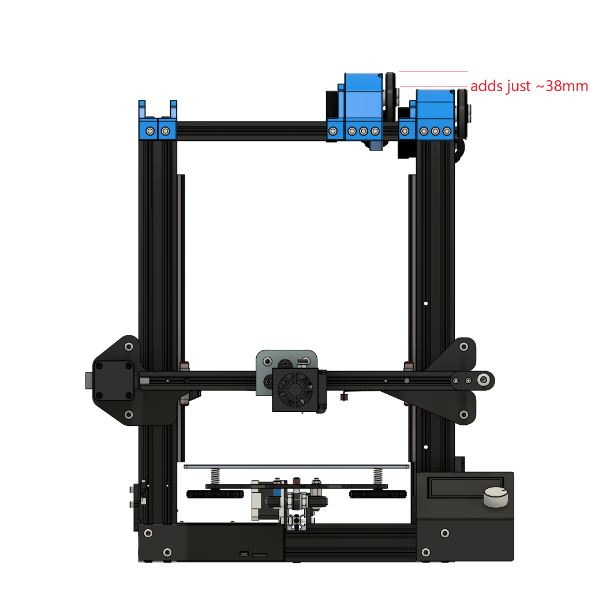
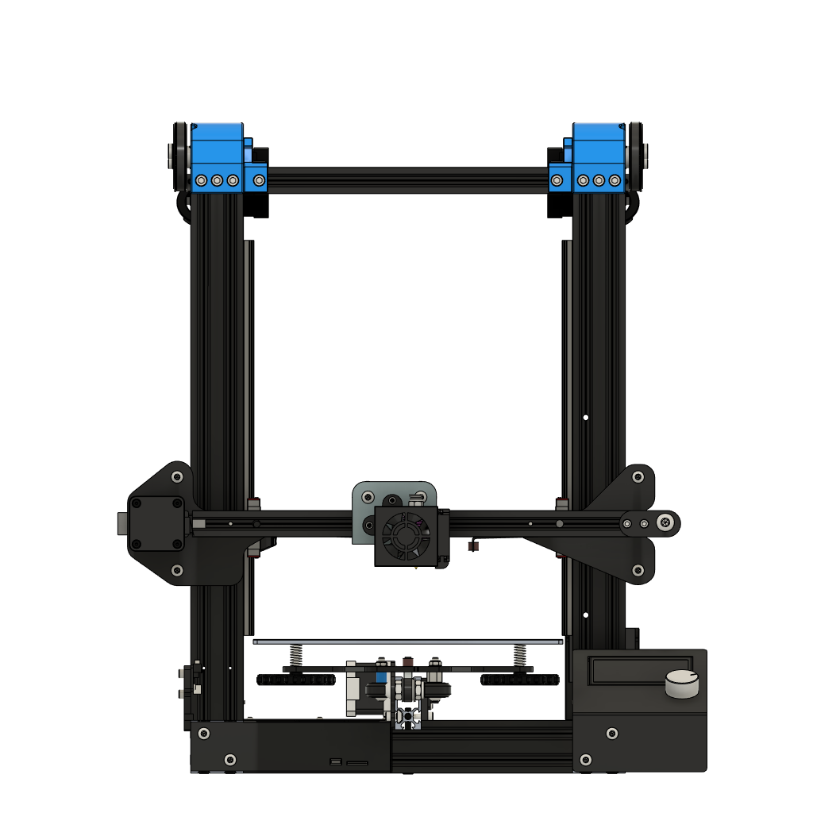

With this parts you can use the Belt Driven Ender 3 in your Lack enclosure. It adds just a height of 38mm, there's no way to get it lower without changing the belt path.
For single Z the BOM is still the same, but you will need a longer rof because the transmission is mounted on the side.
For dual Z its also the same. 

### Versions
1: Single Z        |  2: Dual Z   
:-------------------------:|:-------------------------:
  |   

